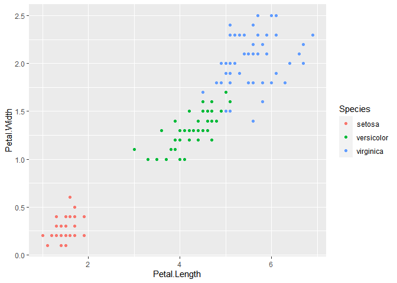

RMarkdown and Git test
================

``` r
colnames(iris)
```

    ## [1] "Sepal.Length" "Sepal.Width"  "Petal.Length" "Petal.Width"  "Species"

``` r
library(ggplot2)
ggplot(iris, aes(x=Petal.Length, y=Petal.Width, col=Species)) + geom_point()
```

<!-- -->

``` r
library(tidyverse)
```

    ## -- Attaching packages --------------------------------------- tidyverse 1.3.0 --

    ## v tibble  3.0.4     v dplyr   1.0.2
    ## v tidyr   1.1.2     v stringr 1.4.0
    ## v readr   1.4.0     v forcats 0.5.0
    ## v purrr   0.3.4

    ## -- Conflicts ------------------------------------------ tidyverse_conflicts() --
    ## x dplyr::filter() masks stats::filter()
    ## x dplyr::lag()    masks stats::lag()

``` r
iris %>%
  group_by(Species) %>%
  summarise(avg_length=mean(Petal.Length), avg_width=mean(Petal.Width))
```

    ## `summarise()` ungrouping output (override with `.groups` argument)

    ## # A tibble: 3 x 3
    ##   Species    avg_length avg_width
    ##   <fct>           <dbl>     <dbl>
    ## 1 setosa           1.46     0.246
    ## 2 versicolor       4.26     1.33 
    ## 3 virginica        5.55     2.03
